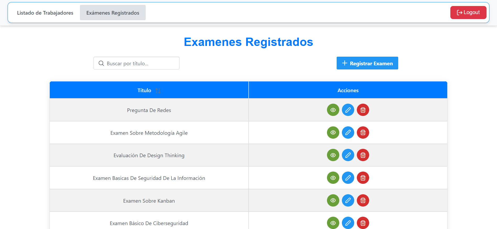
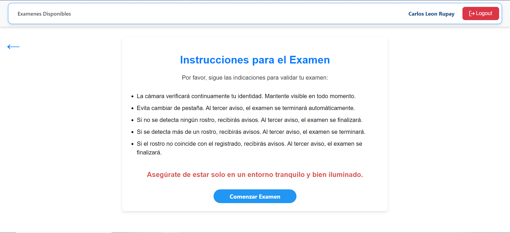
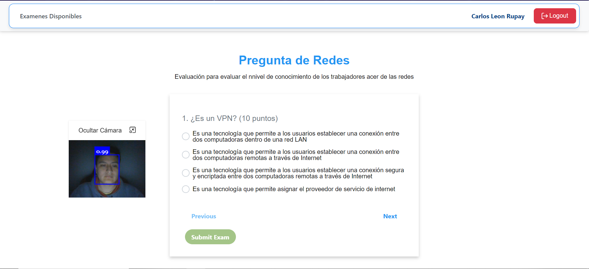

# PortalRecognized

**PortalRecognized** es una aplicación basada en Angular diseñada para gestionar exámenes en línea con reconocimiento facial. El sistema asegura la identidad de los participantes durante todo el examen mediante la comparación de la imagen registrada del trabajador con capturas en tiempo real durante la evaluación.

## Descripción

PortalRecognized facilita la administración y toma de exámenes en entornos virtuales, asegurando la autenticidad de los participantes a través de tecnologías de reconocimiento facial. Utiliza `face-api.js` para la detección y verificación de rostros, lo que permite a los administradores configurar exámenes y a los trabajadores participar de manera segura. El proyecto está enfocado en proporcionar una solución robusta y fácil de usar para empresas IT que buscan asegurar la integridad en sus procesos de evaluación en línea.

## Visuales

PortalRecognized ofrece una interfaz intuitiva y fácil de usar para gestionar y tomar exámenes en línea con autenticación facial. A continuación, se muestran algunas capturas de pantalla que ilustran cómo funciona la aplicación:


*Vista de un examen registrado, donde los administradores pueden gestionar los exámenes asignados a los trabajadores.*


*Sección de instrucciones antes del examen, proporcionando a los trabajadores toda la información necesaria y las reglas a seguir durante la evaluación.*


*Pantalla principal del examen, con la cámara habilitada para la verificación continua del rostro del participante, asegurando la identidad a lo largo del proceso.*


### Prerrequisitos 📋

Necesitarás tener instalado lo siguiente:

- **Sistema Operativo**: Windows 10 / Ubuntu 20.04
- **Node.js**: Versión 18 o superior
- **Angular CLI**: Versión 17.3.4
- **Firebase CLI**: Para la gestión de base de datos y almacenamiento
- **Git**: Para la gestión del control de versiones

### Instalación 🔧

Sigue estos pasos para configurar el entorno de desarrollo:

1. **Clona el repositorio:**

   ```bash
   git clone https://github.com/carlos130702/portal-recognigzed.git
   cd portalrecognized
   ```
2. **Instala las dependencias:**
   Ejecuta el siguiente comando para instalar todas las dependencias necesarias:
   ```bash
   npm install
   ```
3. **Configura las credenciales de Firebase:**

   Asegúrate de configurar tus credenciales de Firebase en el archivo environment.ts ubicado en la carpeta src/environments. Debes proporcionar la configuración de tu proyecto Firebase, incluyendo las claves de API y URLs requeridas.

4. **Inicia el servidor de desarrollo:**

Inicia el servidor de desarrollo con el siguiente comando:

   ```bash
   ng serve
   ```

Luego, navega a http://localhost:4200/ en tu navegador para ver la aplicación en funcionamiento. La aplicación se recargará automáticamente si realizas cambios en los archivos de origen.

### Despliegue 📦

Para desplegar este proyecto en un entorno de producción, sigue los siguientes pasos:

1. **Construye el proyecto:** Ejecuta el comando de construcción para compilar el proyecto:
   ```bash
   ng build-prod
   ```
   Los artefactos de construcción se almacenarán en el directorio dist/. Asegúrate de configurar correctamente las variables de entorno y las credenciales necesarias para tu entorno de producción.
2. **Despliega en tu plataforma preferida:**

Puedes desplegar los archivos compilados en cualquier servidor web. Algunos ejemplos incluyen:
- **Firebase Hosting**:  Puedes usar Firebase para desplegar fácilmente tu aplicación Angular:
   ```bash
   firebase deploy
   ```

### Construido Con 🛠️

- **Angular**: El framework principal utilizado para el desarrollo frontend
- **face-api.js**: Biblioteca utilizada para la detección y reconocimiento facial
- **Firebase**: Utilizado para la autenticación, almacenamiento de datos y hospedaje.
- **PrimeNG**: Conjunto de componentes UI para Angular para mejorar la interfaz de usuario.
- **PrimeFlex**: Biblioteca de utilidades CSS para diseño responsivo.
- **TypeScript**: Lenguaje de programación principal para la escritura de componentes y servicios.
- **HTML5 y CSS3**: Para la estructura y el diseño visual de la aplicación.
